<div align="center">

# Earthworm Jim HD: PC Port

### Earthworm Jim HD on PC, running natively, with the TRG launcher and the options of a modern PC release.

[](https://github.com/TekRantGaming/earthworm-jim-hd-recompiled/releases/latest)
[](https://github.com/TekRantGaming/earthworm-jim-hd-recompiled/releases)


<sub>The original Xbox 360 game code, translated to native PC code with the <a href="https://github.com/rexglue/rexglue-sdk">ReXGlue SDK</a>. <b>No game files included</b>: bring your own Earthworm Jim HD Xbox Live Arcade package.</sub>

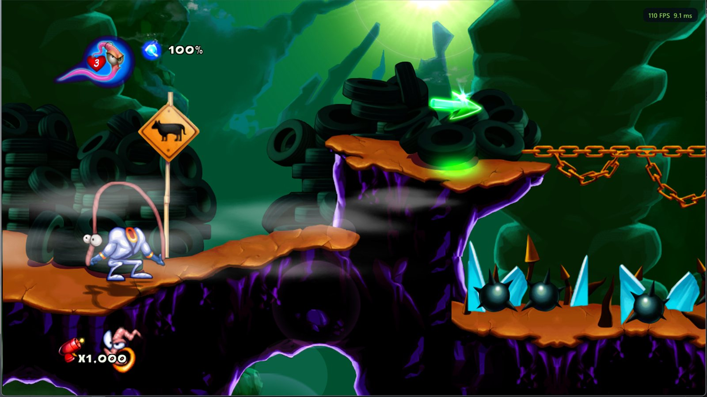

</div>

## What you need

- Windows 10 or 11, 64-bit, and a DirectX 12 graphics card
- **Your own Earthworm Jim HD Xbox Live Arcade package**, this exact release:

| | |
| --- | --- |
| Game | Earthworm Jim HD (Gameloft, 2010), Xbox Live Arcade |
| Title ID | `584109E2` |
| Content type | `000D0000` (Xbox Live Arcade) |
| Package file | `8510D3A10187458FD69203D1E4067E736923865658`, 455,823,360 bytes, `LIVE` package |
| Where it is on an Xbox 360 drive | `Content\0000000000000000\584109E2\000D0000\` |
| Game version | `default.xex` version **1.0.0.11**, built 2010-04-27, no title update |
| `default.xex` | 26,726,400 bytes, CRC32 `D6366187`, SHA-1 `62D9D28A3BCE42843607C26AB4B200E91CB31203` |

The launcher checks the title ID when you pick the package, and checks `default.xex` after installing. Any other
version (another revision or a title update) is refused with a message, because the port is built for this exact
game code. The package file's own checksum differs from player to player (its header carries the owner's licence),
so `default.xex` is what identifies the version.

## Installing

1. Download **EarthwormJimHD-v0.9.0-windows-x64.zip** from the [latest release](https://github.com/TekRantGaming/earthworm-jim-hd-recompiled/releases/latest) and unzip it anywhere.
2. Run **earthworm_jim_hd.exe**. The launcher opens.
3. On the **Play** page click **Install from package...** and pick your package file (or drop it onto the window).
   Its files (about 430 MB) are copied into the `game` folder next to the program.
4. Press **PLAY**.

New versions are found automatically: when the launcher opens it checks this repository's releases and offers to
update (About page: **Updates: Ask / Automatic / Off**). Your game files, saves and settings are kept.

## The launcher

The launcher uses art from your own copy of the game (its banner and icon, and its title screen after the first
play). Settings are saved to `earthworm_jim_hd.toml` next to the program. Turn the launcher off on the Play page and
**hold Shift** while starting to bring it back.

<table>
<tr>
<td width="55%">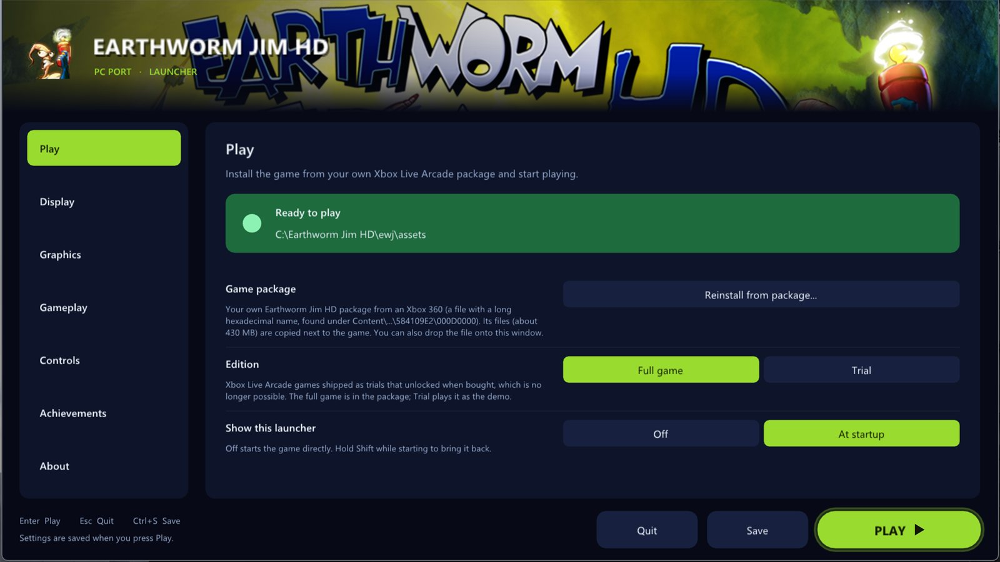</td>
<td valign="middle">

### Play
- **Install from your XBLA package**, with the title ID and game version checked
- **Full game or Trial**: XBLA games shipped as trials unlocked by buying them; the full game is on by default
- Show the launcher at startup, or not

</td>
</tr>
<tr>
<td valign="middle">

### Display
- **Windowed** or **fullscreen**, **window size**, **monitor**
- **VSync** on or off
- **Letterbox 16:9** or **stretch** on other screen shapes

</td>
<td width="55%">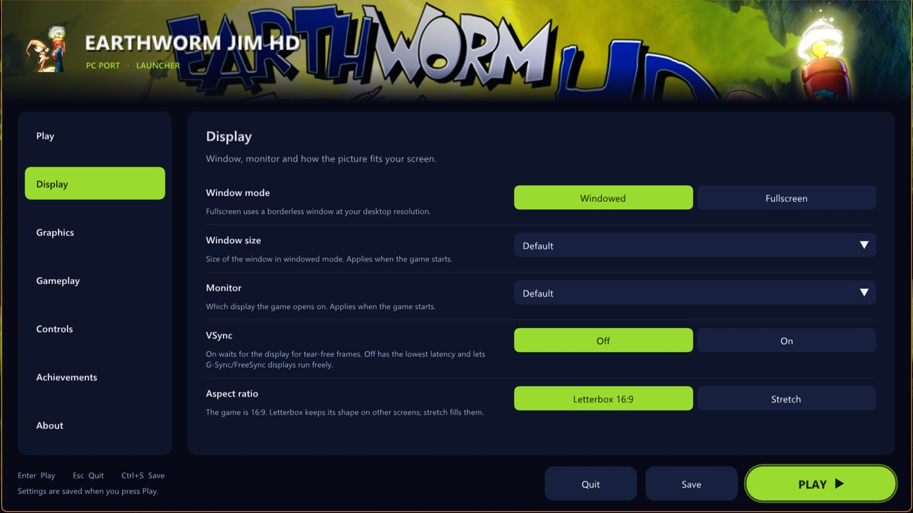</td>
</tr>
<tr>
<td>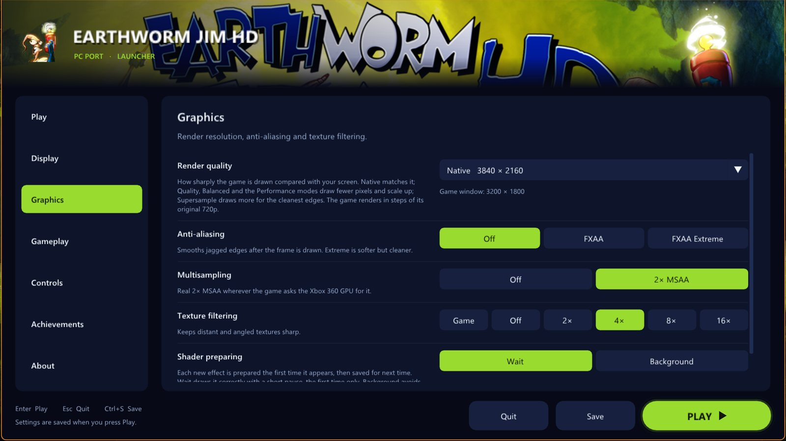</td>
<td valign="middle">

### Graphics
- **Render quality** presets from Supersample to Ultra Performance, showing the real resolution for your screen
- **Custom resolution** from 1x (720p) to 6x (8K)
- **FXAA**, **2x MSAA**, **texture filtering** up to 16x

</td>
</tr>
<tr>
<td valign="middle">

### Gameplay
- **Frame-rate cap**: 30, 60, 120, 144, 165, 240 or unlimited, at the game's normal speed
- **Frame counter** (<kbd>F2</kbd>)
- **Language**: English, French, German, Spanish, Italian, Japanese

</td>
<td>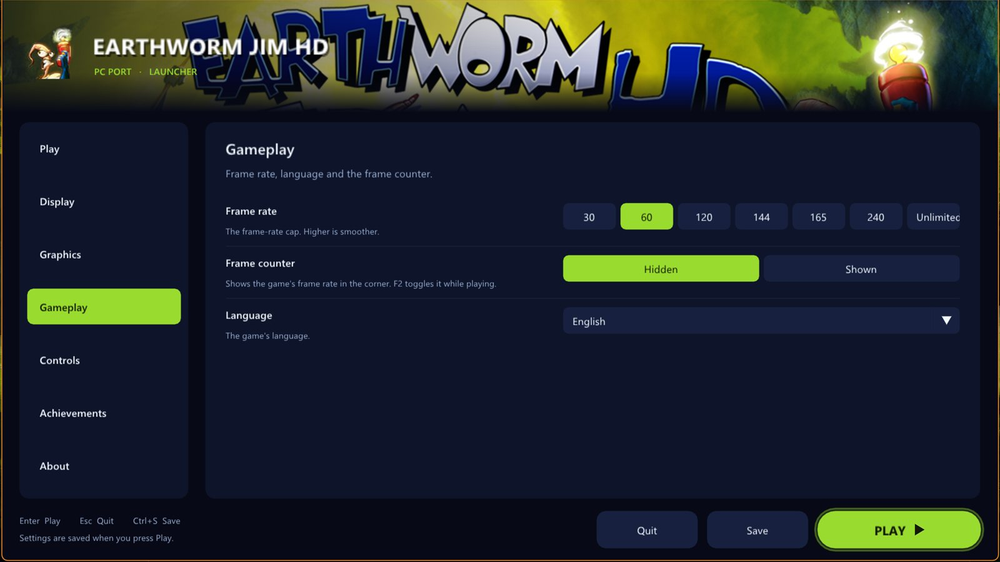</td>
</tr>
<tr>
<td>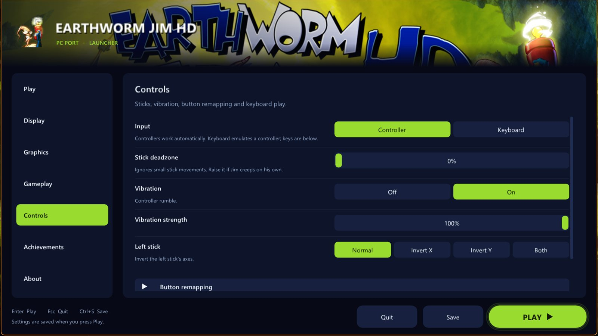</td>
<td valign="middle">

### Controls
- Controller or **keyboard**, with your own key bindings
- **Stick deadzone**, **vibration** strength, left-stick inversion
- **Remap any button**

</td>
</tr>
<tr>
<td valign="middle">

### Achievements
- Xbox 360-style **pop-ups** with a sound you can choose (or your own `.wav`)
- Your progress on the game's achievements, with their own pictures

</td>
<td>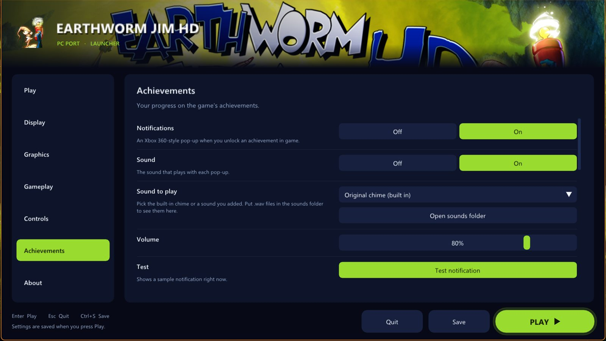</td>
</tr>
<tr>
<td>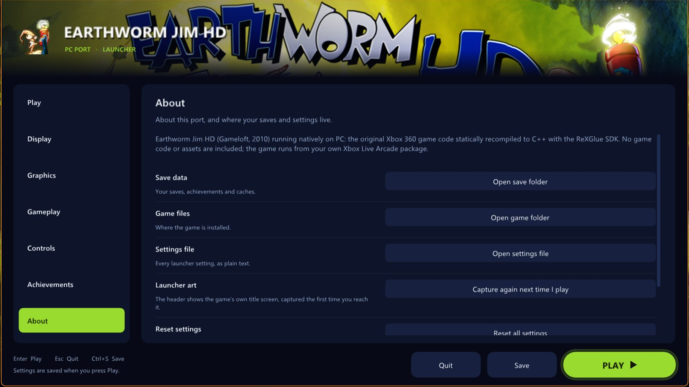</td>
<td valign="middle">

### About
- **Updates**: ask, automatic or off, and Check now
- Open the save, game and settings folders; reset all settings

</td>
</tr>
</table>

## Screenshots

| | |
| --- | --- |
| 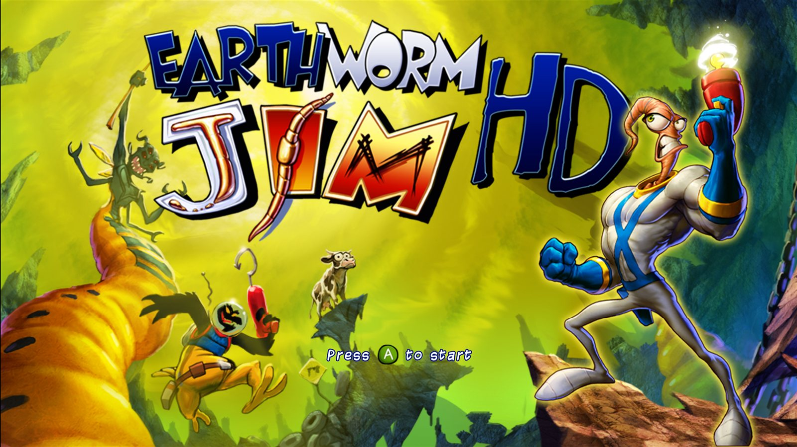 | 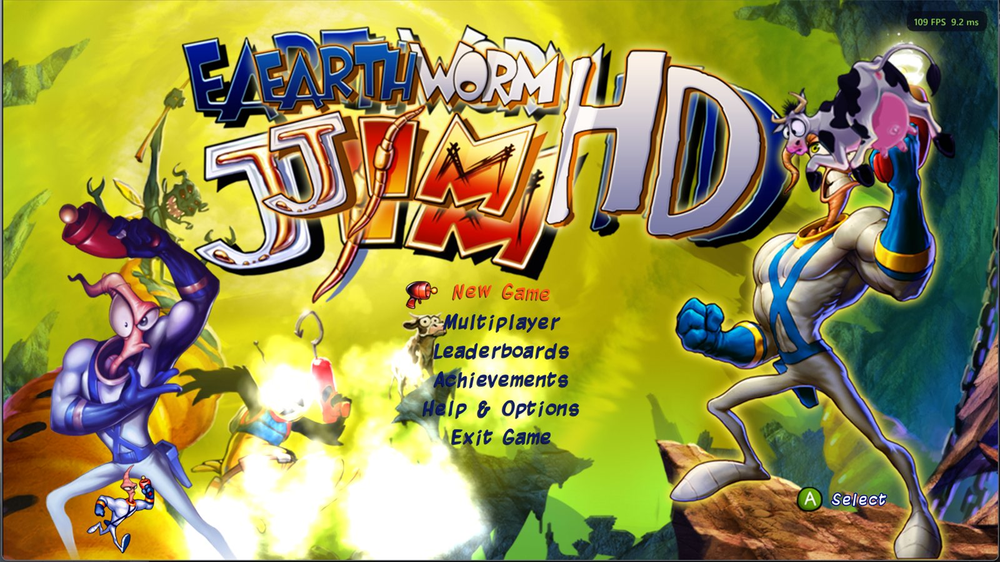 |
| 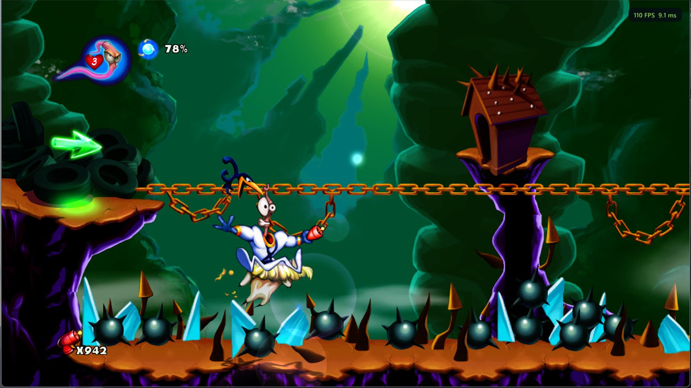 | 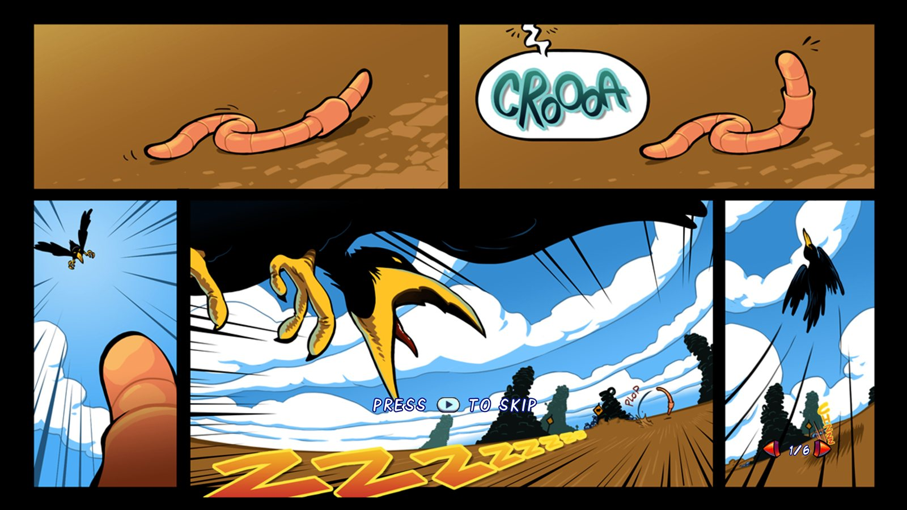 |

## Reporting problems

If the game crashes, `crash-<date>.txt` and `crash-<date>.dmp` are written to the `logs` folder next to the program.
Please attach both to an [issue](https://github.com/TekRantGaming/earthworm-jim-hd-recompiled/issues), with a line
about what you were doing.

## Building it yourself

Instead of the prebuilt zip you can build the port on your own PC from your package: download the
**EarthwormJimHD-Builder** zip from the release (or clone this repository with `--recursive`) and double-click
**Build Earthworm Jim HD.bat**. It installs the build tools if needed (Visual Studio 2022 Build Tools with Clang,
CMake, Ninja), downloads the ReXGlue SDK, translates the game code from your package and compiles it (15 to 30
minutes, about 5 GB free).

Manual steps:

```powershell
.\setup.ps1 -Package "D:\path\to\584109E2\000D0000\<your package file>"
```

```bash
ewj\build.bat
```

[NOTES.md](NOTES.md) describes how the recompilation works and every fix the port needed.

## Credits

- Earthworm Jim HD by Gameloft (2010); Earthworm Jim is a trademark of Interplay Entertainment Corp. This project is
  not affiliated with or endorsed by them, and contains none of their files.
- [ReXGlue SDK](https://github.com/rexglue/rexglue-sdk) for the recompiler and runtime (BSD 3-Clause).
- [TRG Launcher](https://github.com/TekRantGaming/trg-launcher), from the Outpost Kaloki X and King Kong ports.

## AI disclosure

This port was developed with the help of AI tools. AI was used for analysing the game's code, writing much of the
port's source code (including the launcher pages, game fixes and build tools) and drafting the documentation. All of
it was directed, tested and reviewed by the maintainer, and every change is tracked in this repository.
